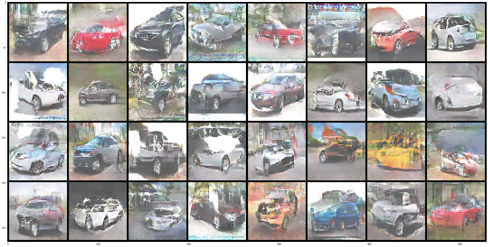

# This Car Does Not Exist
This project serves as the Capstone project for the course Deep Learning and Applications



# Usage tutorial
First you would need to clone the code
```bash
git clone --single-branch --branch final https://github.com/louisdo/This-Galaxy-Does-Not-Exist.git
pip install -r This-Galaxy-Does-Not-Exist/requirements.txt
```

To train the model
```bash
cd This-Galaxy-Does-Not-Exist/src/model_trainer
python train.py --ckpt_folder path/to/checkpoint/folder --eval_folder path/to/eval/folder
```

To run evaluation
```bash
cd This-Galaxy-Does-Not-Exist/src/eval
python eval.py --eval_folder path/to/eval/folder
```

To run inference
```bash
cd This-Galaxy-Does-Not-Exist/src/model
python infer.py --ckpt_path path/to/checkpoint/folder/checkpoint.pth.tar --num_images 64 --where_to path/to/infer/image
```
